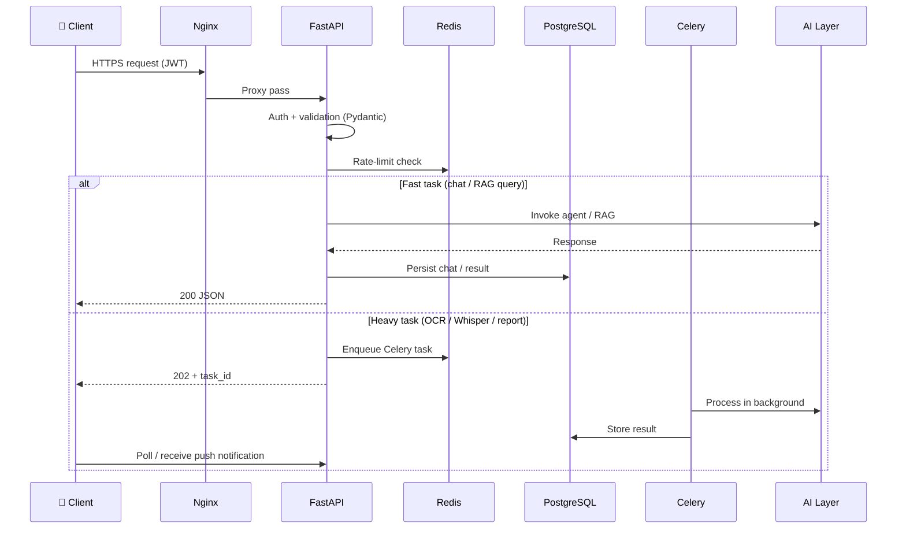
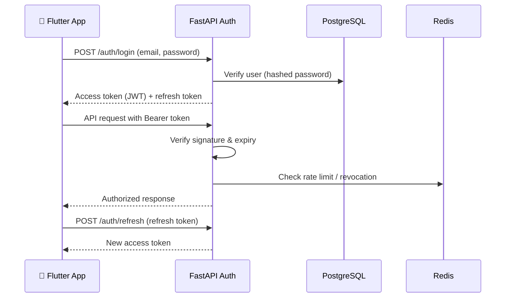
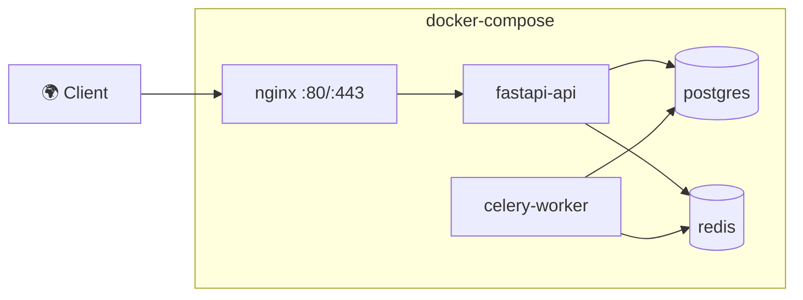
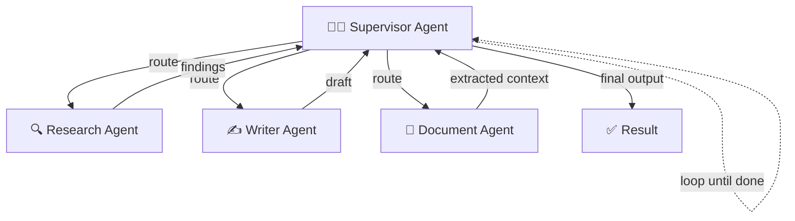
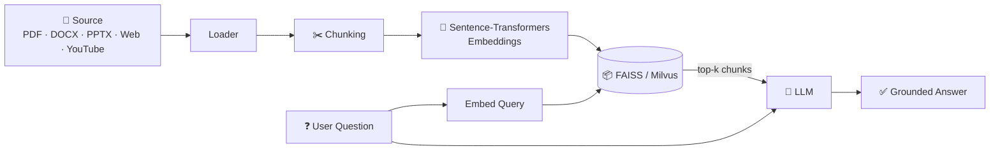
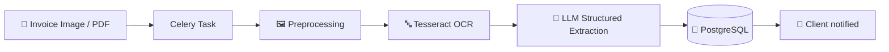
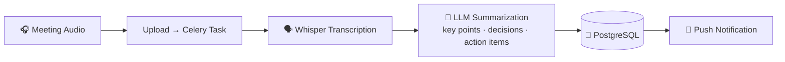
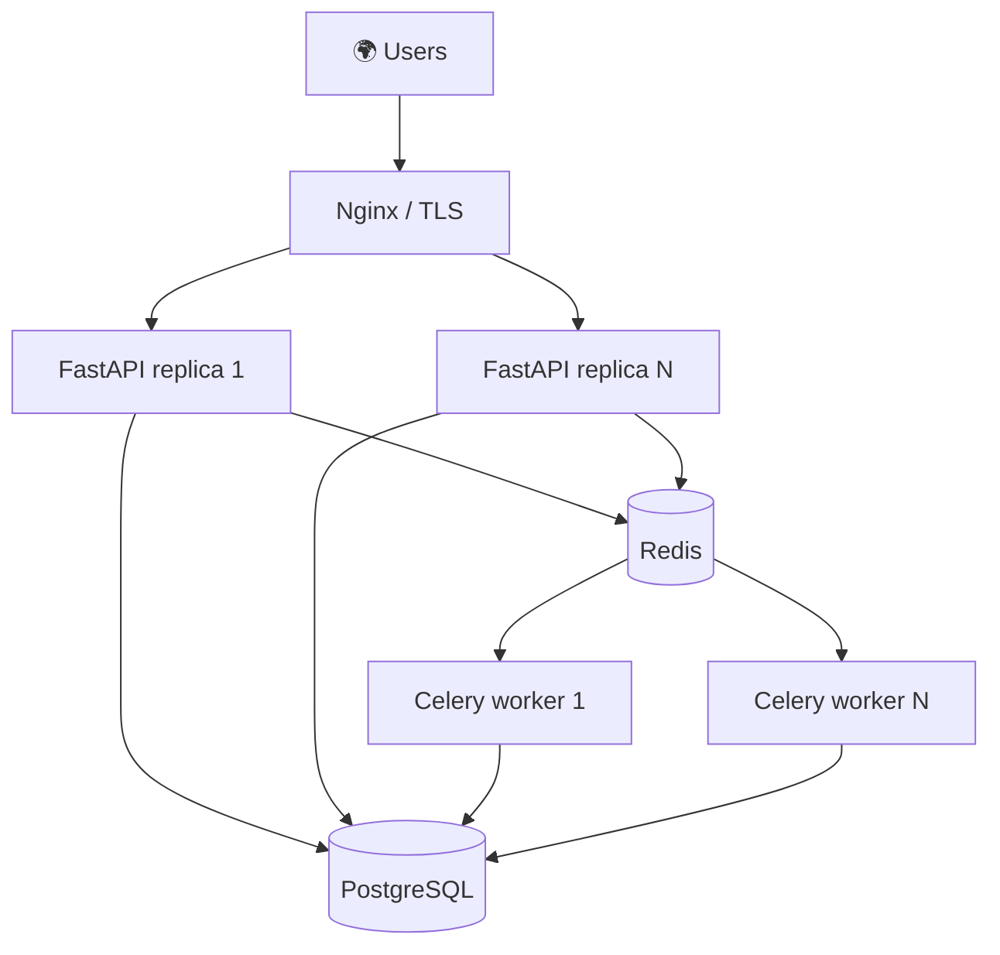

<div align="center">
<!-- BANNER: Replace with your project banner (recommended 1280×400) -->
# 🧠 AI Business OS

 
### The AI Business Operating System
 
**Not just another chatbot — a production-grade AI platform that automates business work using multiple cooperating AI agents, RAG, OCR, speech, and workflow automation.**
 
[](https://www.python.org/)
[](https://fastapi.tiangolo.com/)
[](https://flutter.dev/)
[](https://github.com/langchain-ai/langgraph)
[](https://www.postgresql.org/)
[](https://redis.io/)
[](https://www.docker.com/)
[](LICENSE)
[](CONTRIBUTING.md)
 
[Overview](#-overview) •
[Features](#-key-features) •
[Architecture](#-architecture) •
[Installation](#-installation) •
[API](#-api-examples) •
[Docs](#-documentation) •
[Roadmap](#-roadmap)
 
</div>
---
 
## 📖 Overview
 
**AI Business OS** is a full-stack, multi-tenant AI platform that brings LLMs, Retrieval-Augmented Generation (RAG), multi-agent orchestration, OCR, and speech processing together into one coherent system for automating everyday business work — from chatting with documents and websites to summarizing meetings, reading invoices, drafting emails, and running autonomous research workflows.
 
It ships as a complete product, not a demo:
 
- ⚙️ **Async FastAPI backend** with Celery background workers
- 🤖 **LangGraph multi-agent orchestration** on top of LangChain
- 🔌 **Provider-agnostic LLM layer** — switch between OpenAI and a local LLM with one config value
- 👥 **Multi-tenant team workspaces** with a shared, workspace-scoped knowledge base
- 📱 **Full Flutter mobile app** with voice input, offline cache, and push notifications
- 🐳 **One-command Docker Compose deployment** (Postgres + Redis + API + Workers + Nginx)
---
 
## 💡 Why AI Business OS?
 
Most AI projects are a single chat endpoint wrapped around one model. AI Business OS is designed as an **operating system for business AI**: many capabilities, one architecture, one deployment.
 
| | Typical chatbot project | **AI Business OS** |
|---|---|---|
| Scope | Single chat endpoint | 12 modules (chat, RAG, OCR, speech, agents, workflows) |
| Architecture | Sync script / notebook | Async FastAPI + Celery + Redis + PostgreSQL + Nginx |
| Long-running work | Blocks the request | Offloaded to background workers with task tracking |
| LLM provider | Hard-coded | Pluggable — OpenAI **or** local LLM via one switch |
| Tenancy | Single user | Multi-tenant workspaces with scoped knowledge bases |
| Client | Web page only | Full Flutter mobile app (voice, offline, push) |
| Deployment | Manual | Docker Compose, reverse-proxied behind Nginx |
 
---
 
## ✨ Key Features
 
### 🗣️ Conversational AI
| Feature | Description |
|---|---|
| 💬 **AI Chat** | General-purpose assistant with conversational memory |
| 👨‍💻 **Coding Assistant** | Code-tuned prompting for programming help |
| ✉️ **Email Assistant** | LLM drafting agent for professional email replies |
 
### 📚 Knowledge & RAG
| Feature | Description |
|---|---|
| 📄 **Document Chat** | Ask questions across PDF, DOCX, and PPTX files |
| 🌐 **Website Chat** | Scrape any site and chat with its content |
| ▶️ **YouTube Chat** | Chat with video transcripts |
| 🗂️ **Team Knowledge Base** | Workspace-scoped vector store shared by your team |
 
### 👁️ Perception (OCR & Speech)
| Feature | Description |
|---|---|
| 🧾 **Invoice Reader** | Tesseract OCR → structured field extraction |
| 🎙️ **Meeting Summarizer** | Whisper transcription → LLM summary, run in background |
 
### 🤖 Autonomous Agents
| Feature | Description |
|---|---|
| 🔍 **Research Agent** | LangGraph plan → search → synthesize loop |
| 📊 **Report Generator** | Agent + templating pipeline executed by Celery |
| 🕸️ **Multi-Agent Workflows** | LangGraph supervisor coordinating worker agents |
 
---
 
## 🏗️ Architecture
 
### High-Level Architecture
 
```mermaid
flowchart TB
    subgraph Client
        A[📱 Flutter App]
    end
    A -- HTTPS --> N[🌐 Nginx Reverse Proxy]
    N --> F[⚡ FastAPI - async]
 
    subgraph Data Layer
        P[(🐘 PostgreSQL<br/>users · docs · chats · invoices)]
        R[(🔴 Redis<br/>cache · broker · rate limits · pub/sub)]
    end
 
    subgraph Workers
        C[⚙️ Celery Workers<br/>OCR · Whisper · ingest · reports]
    end
 
    subgraph AI Layer
        LG[🕸️ LangGraph Agents]
        LC[🦜 LangChain]
        LLM[🧠 LLM Provider<br/>OpenAI | Local]
        V[(📦 FAISS / Milvus)]
        E[Sentence-Transformers]
        W[Whisper]
        T[Tesseract]
    end
 
    F --> P
    F --> R
    R --> C
    C --> P
    F --> LG
    C --> LG
    LG --> LC --> LLM
    LC --> V
    LC --> E
    C --> W
    C --> T
```
 
> Full deep-dive (data flow, agent graphs, scaling) in [`docs/ARCHITECTURE.md`](docs/ARCHITECTURE.md).
 
### 🧭 Why This Architecture?
 
Every component earns its place:
 
- **FastAPI** — native async I/O keeps the API responsive while it awaits LLM calls, DB queries, and Redis. Automatic OpenAPI docs, Pydantic validation, and dependency injection make the codebase clean and self-documenting.
- **LangGraph** — plain LLM chains are linear; business workflows aren't. LangGraph models agents as **stateful graphs** with branching, loops, and a supervisor pattern, which is exactly what plan→search→synthesize and multi-agent coordination require.
- **Redis** — one service, three jobs: response/cache layer, Celery message broker, and shared state for rate limiting and pub/sub. Fewer moving parts, less operational overhead.
- **Celery** — OCR, Whisper transcription, document ingestion, and report generation can take minutes. Running them in background workers keeps HTTP requests fast and lets workers scale independently of the API.
- **PostgreSQL** — relational integrity for users, workspaces, chats, documents, and invoices, plus JSONB for flexible AI payloads. Battle-tested, and a natural fit for multi-tenant row-level scoping.
- **Docker** — the stack has six services; Compose makes it reproducible on any machine with one command and mirrors the production topology in development.
- **Nginx** — TLS termination, static files, buffering, and a single public entry point in front of the API.
---
 
## 🔄 System Flow
 
### Request Lifecycle
 

 
### Authentication Flow
 

 
---
 
## 🛠️ Tech Stack
 
| Layer | Technology | Role |
|---|---|---|
| **API** | FastAPI (async) + Pydantic | HTTP layer, validation, OpenAPI docs |
| **Agents** | LangGraph + LangChain | Multi-agent orchestration, chains, tools |
| **LLM** | OpenAI **or** local LLM | Provider-agnostic via config switch |
| **Embeddings** | Sentence-Transformers | Vectorization for RAG |
| **Vector Store** | FAISS / Milvus | Similarity search over chunks |
| **Speech** | Whisper | Meeting/audio transcription |
| **OCR** | Tesseract | Invoice & document text extraction |
| **Database** | PostgreSQL | Users, workspaces, chats, docs, invoices |
| **Cache / Broker** | Redis | Caching, Celery broker, rate limiting, pub/sub |
| **Workers** | Celery | Background OCR, transcription, ingestion, reports |
| **Proxy** | Nginx | TLS, routing, buffering |
| **Mobile** | Flutter 3.x | Cross-platform app (voice, offline, push) |
| **Infra** | Docker Compose | One-command reproducible deployment |
 
---
 
## 📂 Repository Structure
 
```
ai-business-os/
├── 📁 backend/                # FastAPI application
│   ├── app/
│   │   ├── api/               #   Route handlers (/api/v1/*)
│   │   ├── agents/            #   LangGraph agents & workflows
│   │   ├── rag/               #   Loaders, chunking, retrieval
│   │   ├── workers/           #   Celery tasks (OCR, Whisper, ingest, reports)
│   │   ├── core/              #   Config, auth, rate limiting, logging
│   │   └── models/            #   SQLAlchemy models & Pydantic schemas
│   └── tests/
├── 📁 mobile/                 # Flutter app (chat, voice, files, workspaces)
├── 📁 nginx/                  # Reverse proxy configuration
├── 📁 docs/                   # Architecture, API, deployment docs
├── 📁 scripts/                # Dev helpers & DB seeding
├── 🐳 docker-compose.yml      # Postgres + Redis + API + Worker + Nginx
└── 📄 .env.example            # Environment template
```
 
---
 
## 🧩 Modules
 
| Module | Endpoint | Core Tech |
|---|---|---|
| 💬 AI Chat | `/api/v1/chat` | LLM + conversational memory |
| 📄 Document Chat (PDF/DOCX/PPTX) | `/api/v1/documents` | Loaders → chunks → FAISS RAG |
| 🌐 Website Chat | `/api/v1/website` | Scraper → RAG |
| ▶️ YouTube Video Chat | `/api/v1/youtube` | Transcript → RAG |
| 🎙️ Meeting Summarizer | `/api/v1/meetings` | Whisper → LLM summary (Celery) |
| ✉️ Email Assistant | `/api/v1/email` | LLM drafting agent |
| 🧾 Invoice Reader (OCR) | `/api/v1/invoices` | Tesseract OCR → structured extraction |
| 🔍 AI Research Agent | `/api/v1/research` | LangGraph plan → search → synthesize |
| 📊 AI Report Generator | `/api/v1/reports` | Agent + templating (Celery) |
| 👨‍💻 AI Coding Assistant | `/api/v1/coding` | Code-tuned prompting |
| 🗂️ Team Knowledge Base | `/api/v1/kb` | Workspace-scoped vector store |
| 🕸️ Multi-Agent Workflow | `/api/v1/workflows` | LangGraph supervisor + workers |
 
---
 
## 🔌 API Examples
 
<details>
<summary><b>💬 Chat with the assistant</b></summary>
```bash
curl -X POST http://localhost:8080/api/v1/chat \
  -H "Authorization: Bearer $TOKEN" \
  -H "Content-Type: application/json" \
  -d '{"message": "Draft a project status update for my team."}'
```
</details>
<details>
<summary><b>📄 Upload a document & ask questions</b></summary>
```bash
# Upload
curl -X POST http://localhost:8080/api/v1/documents \
  -H "Authorization: Bearer $TOKEN" \
  -F "file=@quarterly-report.pdf"
 
# Query
curl -X POST http://localhost:8080/api/v1/documents/{doc_id}/query \
  -H "Authorization: Bearer $TOKEN" \
  -H "Content-Type: application/json" \
  -d '{"question": "What were the key risks mentioned?"}'
```
</details>
<details>
<summary><b>🧾 Extract structured data from an invoice</b></summary>
```bash
curl -X POST http://localhost:8080/api/v1/invoices \
  -H "Authorization: Bearer $TOKEN" \
  -F "file=@invoice.png"
# → 202 Accepted { "task_id": "..." }  — poll /api/v1/tasks/{task_id}
```
</details>
<details>
<summary><b>🔍 Run the research agent</b></summary>
```bash
curl -X POST http://localhost:8080/api/v1/research \
  -H "Authorization: Bearer $TOKEN" \
  -H "Content-Type: application/json" \
  -d '{"topic": "State of open-source LLM inference in 2026"}'
```
</details>
> Interactive OpenAPI docs are available at **`/docs`** once the stack is running.
 
---
 
## 🚀 Installation
 
### Prerequisites
- Docker & Docker Compose
- An OpenAI API key **or** a local LLM endpoint
### Quick Start
 
```bash
git clone https://github.com/<you>/ai-business-os.git
cd ai-business-os
 
cp .env.example .env      # add OPENAI_API_KEY (or set LLM_PROVIDER=local)
docker compose up --build
```
 
| Service | URL |
|---|---|
| API | http://localhost:8080 |
| Interactive docs | http://localhost:8080/docs |
 
---
 
## 🔐 Environment Variables
 
| Variable | Description | Example |
|---|---|---|
| `LLM_PROVIDER` | `openai` or `local` | `openai` |
| `OPENAI_API_KEY` | Required when provider is `openai` | `sk-...` |
| `DATABASE_URL` | PostgreSQL connection string | `postgresql://...` |
| `REDIS_URL` | Redis connection string | `redis://redis:6379/0` |
| `JWT_SECRET` | Token signing secret | *(generate a strong value)* |
 
> See [`.env.example`](.env.example) for the complete list.
 
---
 
## 🐳 Docker Setup
 
`docker-compose.yml` brings up the full stack:
 

 
| Container | Purpose |
|---|---|
| `nginx` | Public entry point, TLS, proxying |
| `api` | Async FastAPI application |
| `worker` | Celery background workers |
| `postgres` | Primary datastore |
| `redis` | Cache + broker + rate limits |
 
---
 
## 📱 Mobile App
 
The Flutter app is a first-class client, not an afterthought:
 
- 🎙️ **Voice input** for hands-free interaction
- 📴 **Offline cache** for recent chats and documents
- 🔔 **Push notifications** when background tasks (summaries, reports, OCR) complete
- 👥 **Workspace switching** for multi-tenant teams
- 📎 **File upload** for documents, invoices, and audio
```bash
cd mobile
flutter pub get
flutter run
```
 
---
 
## 🕸️ Multi-Agent Workflow
 
A LangGraph **supervisor** routes work to specialized worker agents and merges their results:
 

 
The supervisor decides **which agent acts next**, evaluates intermediate results, and loops until the task is complete — enabling workflows that a linear chain cannot express.
 
---
 
## 📚 RAG Pipeline
 

 
All vectors are **scoped to the workspace**, so the Team Knowledge Base stays isolated per tenant.
 
---
 
## 👁️ OCR Pipeline
 

 
---
 
## 🎙️ Whisper Pipeline
 

 
---
 
## 🔒 Security
 
- 🔑 **JWT authentication** with refresh tokens
- 🧂 **Hashed passwords** (never stored in plaintext)
- 🚦 **Redis-backed rate limiting** per user/IP
- 🏢 **Workspace isolation** — every query is tenant-scoped at the data layer
- 🌐 **Nginx TLS termination** as the single public entry point
- 🧾 **Pydantic validation** on every request payload
---
 
## 📈 Scalability
 
- **Stateless API** — scale FastAPI horizontally behind Nginx
- **Independent worker scaling** — add Celery workers for OCR/transcription load without touching the API
- **Redis-backed shared state** — rate limits and pub/sub work across replicas
- **Pluggable vector store** — FAISS locally, Milvus when you outgrow a single node
- **Provider-agnostic LLM layer** — swap or self-host models without code changes
## ⚡ Performance
 
- Async I/O end-to-end in the request path (FastAPI + async DB/Redis clients)
- Heavy work (OCR, Whisper, ingestion, reports) never blocks HTTP requests
- Redis caching for repeated lookups and hot data
---
 
## 🏭 Production Features
 
| Capability | Implementation |
|---|---|
| ⚡ Async API | FastAPI with async endpoints |
| 🧠 Caching / broker | Redis |
| ⚙️ Background jobs | Celery workers |
| 🐘 Persistence | PostgreSQL |
| 🐳 Containerization | Docker Compose |
| 🌐 Reverse proxy | Nginx |
| 🔑 Auth | JWT + refresh tokens |
| 🚦 Rate limiting | Redis-backed |
| 📜 Logging | Structured application logs |
| 📊 Monitoring | Health endpoints & task tracking |
| 🔄 Workers | Independently scalable Celery pool |
| 👥 Multi-tenancy | Workspace-scoped data & vectors |
 
---
 
## ☁️ Deployment
 

 
1. Provision a host (or cluster) with Docker
2. Set production values in `.env` (secrets, TLS certs, DB credentials)
3. `docker compose up -d`
4. Scale: `docker compose up -d --scale api=3 --scale worker=4`
Details in [`docs/DEPLOYMENT.md`](docs/DEPLOYMENT.md).
 
---
 
## 🗺️ Roadmap
 
- [ ] Web dashboard client
- [ ] Additional LLM providers
- [ ] Streaming responses for chat modules
- [ ] Fine-grained workspace roles & permissions
- [ ] Additional OCR document types
- [ ] Kubernetes deployment manifests
> Have an idea? [Open an issue](../../issues) — roadmap items are community-driven.
 
---
 
## 📸 Screenshots
 
<!-- Replace with real screenshots -->
| Chat | Document Q&A | Workspaces |
|---|---|---|
|  |  |  |
 
## 🎬 Demo
 
<!-- Replace with a real demo GIF (recommended < 10 MB) -->
<div align="center">
  
</div>
---
 
## 📘 Documentation
 
| Doc | Contents |
|---|---|
| [`docs/ARCHITECTURE.md`](docs/ARCHITECTURE.md) | Data flow, agent graphs, scaling deep-dive |
| [`docs/API.md`](docs/API.md) | Endpoint reference |
| [`docs/DEPLOYMENT.md`](docs/DEPLOYMENT.md) | Production deployment guide |
 
---
 
## 🤝 Contributing
 
Contributions are welcome!
 
1. Fork the repository
2. Create a feature branch: `git checkout -b feat/amazing-feature`
3. Commit your changes: `git commit -m "feat: add amazing feature"`
4. Push and open a Pull Request
Please read [`CONTRIBUTING.md`](CONTRIBUTING.md) for coding standards and the PR process.
 
---
 
## 📄 License
 
Released under the [MIT License](LICENSE).
 
<div align="center">
**⭐ If this project helps you, consider giving it a star — it helps others find it.**
 
</div>
 
